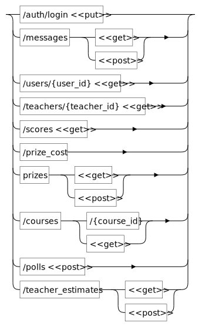
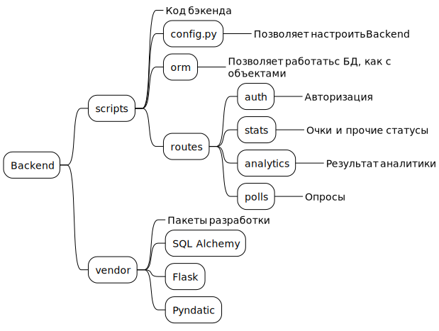
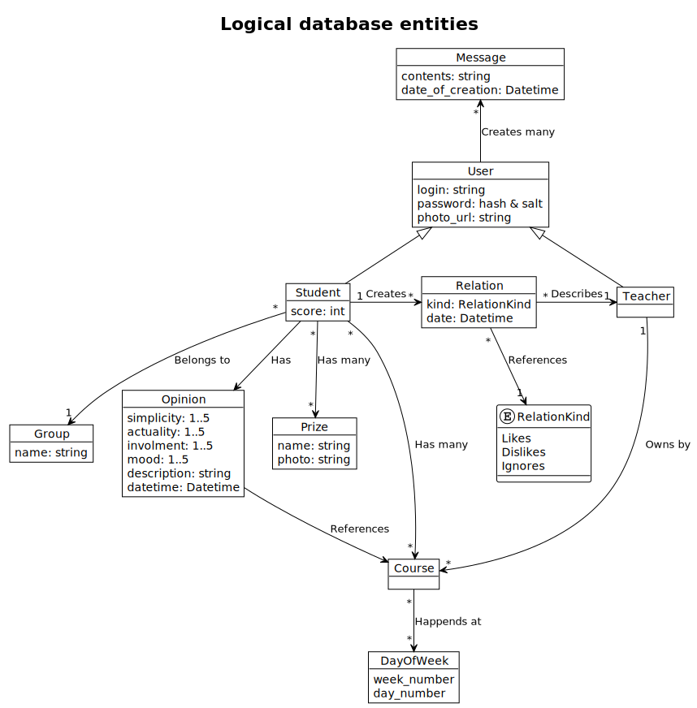

# Neimark2025 -- team work
Application for measuring teach service based on student opinion.

## Links to other works

- Final design: https://www.figma.com/proto/6LrhMivvYUJymI1TK4nrgb/Untitled
- Logical scheme: https://www.figma.com/board/pRnOIVTUh98LVNzMgbhhIW/Neiro-Mark-Hack?node-id=0-1&t=FCl7mh97Hi1esTX3-0
- Presentation: https://docs.google.com/presentation/d/1Up0qxSKGJ6cGYC1HgTOKIHgtytFhEwZA/edit

## Diagrams

Routes:

Backend logical:

Database logical:

